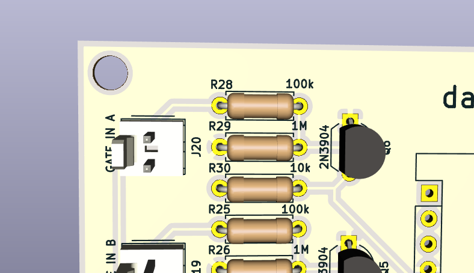

# dac/ino build notes

## General build notes
The main thing to say about building this board is that it is very modular. Most components are associated with one particular input or output and if that input/output is not needed, those components can be omitted.

For example (for the full dac/ino board, similar ideas apply to dac/ino lite):

If you do not need Gate In D you can omit J13, Q4, R18, R19, R20

If you do not need CV In D you can omit D9, D10, J18, R24

If you do not need Gate Out B you can omit J6, Q2, R12, R13

If you do not need CV Out B you can omit C6, J2, J4, R3, R5, R7, R9 (use a wire jumper in place of C6)

Note that R14 is placed near the CV inputs but is not associated with them and should always be installed.

## Full dac/ino

### Silkscreen error
In version 1.3, the silkscreened reference numbers and values for R28 and R29 are reversed. R29 (1M) should be between R28 (100k) and R30 (10k). Fixed in version 1.31. Corrected version looks like this:

 
### dac/ino build notes

The two 1x8 pin headers J7 and J14 duplicate the 2-pin Molex connectors; either or both can be installed and either can be used to connect to the Gate and CV inputs and outputs, and to access VCC and ground. 8-pin Molex connector J21, or in headers J10 and J11, provide access to two additional digital pins and four additional analog pins; these can be used for e.g. panel switches and pots where input protection and conditioning is not needed. Of course you can also omit any of the Molex connectors or pin headers and solder wires directly between the panel and board.

Pin headers J1 and J2 are for output CV range selection. Use a jumper to connect the middle pin to the pin toward the power header edge of the board to get 0–10 V, or the middle pin to the pin toward the CV In edge of the board to get ±5 V; omit the jumper to get 0–5 V. Use trimmers R4 and R5 to adjust the output gain.

Orient the Arduino Nano with the USB connector pointing toward the Analog Output logo.

## dac/ino lite

Provide power to this board by connecting a 6 to 12 V DC source to J9. The "+" on the silkscreen indicates which pin receives voltage, the other is ground.

There are no Gate or CV inputs provided; there are solder pads for direct connection to four digital and four analog pins.

R2 and R3 are output current limiting resistors.

